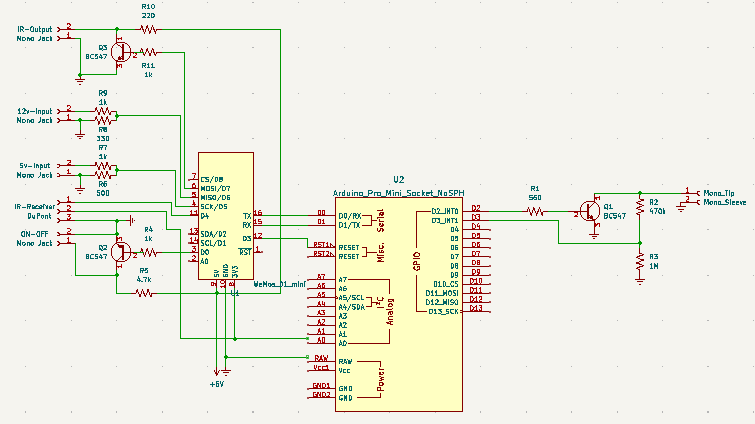

# ESPHome Home Theather Controller with Sony S-Link support

This is an ESPHome controller I made to fully control my home theather setup from Home Assistant. This contorller include includes the following input/outputs that suit my needs, but can be easyly be modified for different setups.
- Sony S-Link Input/Output - Used to controll a Sony CDP-CX225 CD Player
- IR Input - Used to detect ON/OFF and Volume commands from a Roku remote
- IR Output - Used to controll a Yamaha RX-V2700 receiver and a daisy chained IR blaster
- ON/OFF Output (5v) - Used to controll a power conditioner (completly turn off the power to the whole setup)
- 12v ON/OFF Input - Used to detect the ON/OFF status of the Yamaha RX-V2700 receiver
- 5v ON/OFF Input- Used to detect the ON/OFF status of the TV (connected to a USB port of the TV)

## Sony S-Link
An Arduino Pro Mini is used as intrface for the Sony S-Link Bus. The arduino is interfaced with the ESP8622 via a serial connection.
The Arduino sketch is entirely based on the great work from [robho](https://github.com/robho/sony_slink). The only change is that the modified code allows the option of communicating over serial using raw Hex bytes. This is achieved by defining the 'HexOutput' option at the beginning of the code (if this is not defined the code behaves as the original code). 

I'm sucessfully using this setup to control and read information from a Sony CDP-CX225 CD Player.

## Hardware
To physically connect the Arduino to the Sony via the S-Link bus and the ESP8266 to the other devices (e.g. IR blaster, Power Conditioner etc.) some additional components are needed. See schematic below.

The S-Link bus opeartes at a 5v logic level, while the ESP8266 operates at a 3.3v logic level. For Arduino boards there are options that operate either at 3.3v or 5v, therefore the circuit will depend on the type of Arduino board used. The schematics above uses an the 3.3v version of the Arduino Pro Mini, therefore the Arduino can be connected directly to the ESP8266 but R2 and R3 are needed. If an Arduino that operates at 5v logic level is used (e.g. Arduino Nano) then R2 and R3 are not needed but a logic level shifter is instead needed between the Arduino and the ESP8266.

For the Sony S-Link interface a 3.5 mm mono plug shall be used to connect the circuit to the S-Link/Control A1 port of the Sony device.
A 3.5 mm mono plug would be used also to connect to most IR blasers and IR input on receivers, the signal goes on the mono plug tip and the ground on the sleeve.

## Home Assistant interface
### Entities
The ESPHome device exposes a service that is then called from Home Assistant to control the S-Link devices. The command to be sent over S-Link is provided as parameter when calling the service. See the link to www.undeadscientist.com below for the known S-Link commands.
For each device on the S-Link bus specific sensor will need to be defined in the ESPHome yaml configuration file. See the link to www.undeadscientist.com the expected responses from S-Link devices.

### Setup for Sony CDP-CX225

### Card for Sony CDP-CX225

## Additional resources
The S-Link_CDP-CX225.xlxs file in the 'SLink Supported Commands' folder lists the commands I have found work with the CDP-CX225.
The ESPHome yaml configuration file I use for my setup is provided as reference in the 'ESPHme' folder. The [UARTX custom component form eigger](https://github.com/eigger/espcomponents) is used to interface with the Arduino managing the S-Link bus.

----

## Reference documents:
* http://web.archive.org/web/20070720171202/http://www.reza.net/slink/text.txt
* http://web.archive.org/web/20070705130320/http://www.undeadscientist.com/slink/
* http://web.archive.org/web/20180831072659/http://boehmel.de/slink.htm
